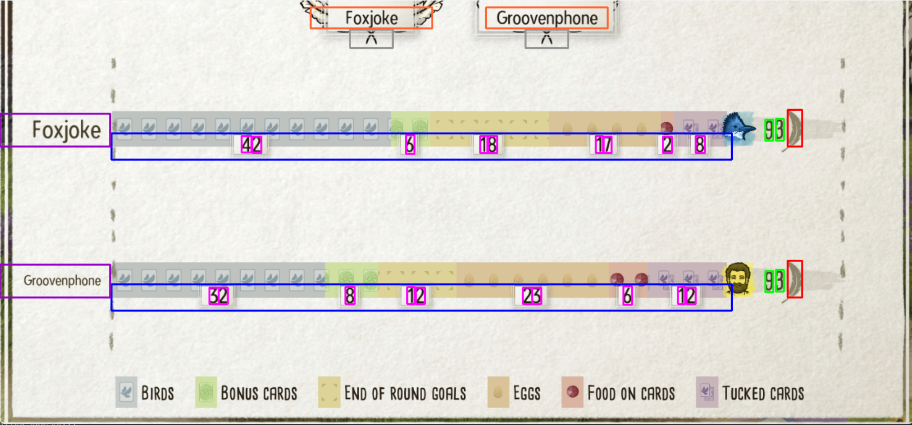
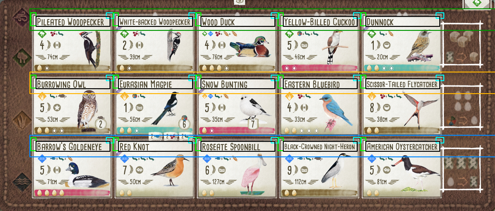

# ScoreBird
A digital Wingspan scoreboard and gameboard helper tool.

## Required Packages

- [numpy](https://pypi.org/project/numpy/)
- [opencv2](https://pypi.org/project/opencv-python/)
- [pillow](https://pypi.org/project/Pillow/)
- [scikit-learn](https://pypi.org/project/scikit-learn/)
- [tesserocr](https://github.com/sirfz/tesserocr)
  - On Windows, I recommend pip installing a tesserocr ```.whl``` file.
  - Be sure to set up a ```TESSDATA_PREFIX``` environment variable with ```tessdata```.

## ScoreBird

ScoreBird is a Wingspan screenshot reader tool for the end of match scores between multiple players which can read the Wingspan players, their scores, and the winner of the match.

Note: ScoreBird performs better with higher quality screenshots.

ScoreBird can be run by manually editing the main() function in src/scoreboard_reader/scorebird.py to point to a Wingspan screenshot file that you want to use.

#### Usage
The scorebird() function can also be called by a separate codebase or tool.  The parameters for the function are as follows:

    scorebird(filename, tournament_name=None, mentioned_players=None, mode=Mode.NO_DISPLAY)

- filename
  - The path to the screenshot file.  This can also be a url location I.E. a discord attachment link.
- tournament_name (optional)
  - The acronym for a tournament.  If given, it will use the associated signup_<tournament_name>.json file in the signups folder.
- mentioned_players (optional)
  - The list of mentioned players using their discord ID.  If given, this will narrow down the players to search for in the signups file.
- mode (optional)
  - The mode of scorebird operation with three options:
    - Mode.NO_DISPLAY: Do not display the screenshot and what has been detected.  Good for discord bot calls where display would be useless.
    - Mode.TESTING: Internal testing mode for mass screenshot testing and accuracy checking.
    - Mode.DISPLAY: Displays the screenshot showing the scores and names detected.
      

#### Returns

ScoreBird returns a dictionary of the winning player(s), the players' scores, and their name if possible.

      {'winner': ['foxjoke', 'Groovenphone'], 
       'player1': 'foxjoke', 
       'score1': 93, 
       'player2': 'Groovenphone', 
       'score2': 93}


## BoardBird

BoardBird is a Wingspan screenshot reader tool for an end of match game boards which can read the names of the birds played and their habitat.

Note: BoardBird performs better with higher quality screenshots.

Note: BoardBird can currently only read the English names of the birds.

BoardBird can be run by manually editing the main() function in src/gameboard_reader/boardbird.py to point to a Wingspan screenshot file that you want to use.

BoardBird is made possible by using a giant json file of all the bird information from Wingsearch, go check it out here! https://navarog.github.io/wingsearch/

#### Usage
The boardbird() function can also be called by a separate codebase or tool.  The parameters for the function are as follows:

    boardbird(filename, mode=Mode.NO_DISPLAY)

- filename
  - The path to the screenshot file.  This can also be a url location I.E. a discord attachment link.
- mode (optional)
  - The mode of boardbird operation with three options:
    - Mode.NO_DISPLAY: Do not display the screenshot and what has been detected.  Good for discord bot calls where display would be useless.
    - Mode.TESTING: Internal testing mode for mass screenshot testing and accuracy checking.
    - Mode.DISPLAY: Displays the screenshot showing the scores and names detected.
      


#### Returns

BoardBird returns a dictionary of the birds in each habitat.

    {'FOREST': ['Pileated Woodpecker', 'White-Backed Woodpecker', 'Wood Duck', 'Yellow-Billed Cuckoo', 'Dunnock'], 
    'GRASSLANDS': ['Burrowing Owl', 'Eurasian Magpie', 'Snow Bunting', 'Eastern Bluebird', 'Scissor-Tailed Flycatcher'], 
    'WETLANDS': ["Barrow's Goldeneye", 'Red Knot', 'Roseate Spoonbill', 'Black-Crowned Night-Heron', 'American Oystercatcher']}
